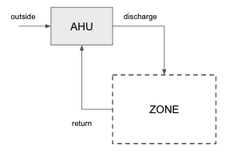
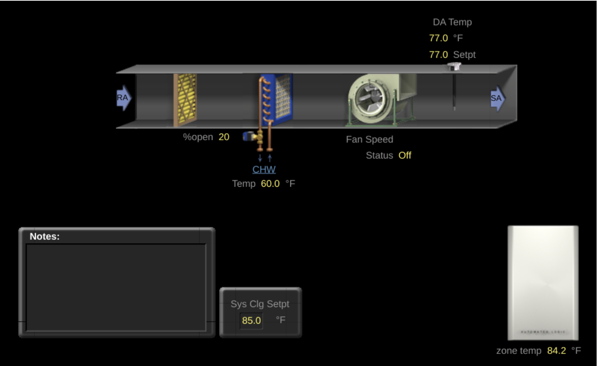

# Modeling Systems and Equipment

Consistency in modeling is a prerequisite to scalable smart building applications. As a result, the published models in the DigitalBuildings project are opinionated about how different types of systems are modeled. This document covers many common system types, and describes how to model them consistently with the rest of the ontology.


## HVAC

### Air Handlers (AHU)

#### Type Definition
Air-handlers are air-side devices that provides air to a zone directly or indirectly via terminal units, providing recirculated, fresh air, or some mixture of both. They can range from small rooftop units to large penthouse constructions; size is not relevant to this class designation.

#### Type Requirements
- It *must* have a fan.
- It *must* condition the air in some way.
- It *must* handle outside air directly (not simply fed by some upstream device).
- It *must* handle return air from the space.


#### Single Zone AHUs
Serve individual spaces directly; there are no modulating terminals. They can be modeled individually.

##### System Diagram



##### Building Config Example
```
# Single zone AHU with unitary onboard controller
AHU-1:
  id: CDM/1pBVNxYc18rOMofSNn8STO
  connections:
  	ZONE-1: FEEDS
  translation:
    discharge_air_temperature_sensor:
      present_value: points.analog_value_1.present_value
      units:
        key: pointset.points.analog_value_1.units
        values:
          degrees_celsius: 'DegC'
    ...
   type: AHU_DFSS_DFVSC_DSP_DXDC
```

###### BMS Example


#### Multi-Zone AHUs
Serve multiple zones via terminals.

##### System Diagram


##### Building Config Example

```
# Multi zone AHU with unitary onboard controller, serving downstream VAVs
AHU-1:
  id: CDM/1pBVNxYc18rOMofSNn8STO
  connections:
  	VAV-1: FEEDS
  	...
  translation:
    supply_air_temperature_sensor:
      present_value: points.analog_value_1.present_value
      units:
        key: pointset.points.analog_value_1.units
        values:
          degrees_celsius: 'DegC'
    ...
   type: AHU_SFSS_SFVSC_DXSC

# The zone-specific VAV
VAV-1:
  id: 3456
  connections:
  	ZONE-1: FEEDS
  	...
  translation:
    zone_air_temperature_sensor:
      present_value: points.analog_value_1.present_value
      units:
        key: pointset.points.analog_value_1.units
        values:
          degrees_celsius: 'DegC'
    ...
   type: VAV_SD_DSP
```

###### BMS Example


### Fan Coil Units (FCU)

#### Type Definition
Fan coil units are air-side devices which provides conditioning to a space. It must be recirculation only (i.e. no integral fresh air capabilities) in order to be considered part of this class. Note that there is no consideration made for space type (e.g. a CRAC unit that serves a server room would be considered a FCU if it is configured based on the type requirements; there is no special designation for zone, and so if this is wanted the unit should be connected to a zone with the appropriate space type designation). There is also no differentiation between a heat pump and a FCU (excepting a heat pump which utilizes outside air directly, or breaks one of the other rules listed below).

#### Type Requirements
- It *must* have a fan.
- It *must* condition the air in some way.
- It *must not* handle outside air directly.
- It *must* handle return air from the space.

#### Single-Zone FCUs
Serve individual zones as stand-alone devices.

##### System Diagram


##### Building Config Example

```
# Single Zone FCU
FCU-1:
  id: CDM/1pBVNxYc18rOMofSNn8STO
  connections:
    ZONE-1: FEEDS
  	...
  translation:
    discharge_air_temperature_sensor:
      present_value: points.analog_value_1.present_value
      units:
        key: pointset.points.analog_value_1.units
        values:
          degrees_celsius: 'DegC'
    ...
   type: FCU_DFSS_DSP_DXZC
```

##### BMS Example



#### Lead Lag Space Control With VAV
Serve individual zones but in cooperation with another system (e.g. an IDF room with lead/standby or lead/lag control scheme, perhaps as day-time VAV and night-time FCU).

##### System Diagram


##### Building Config Example

```
# Lead Lag Zone Control Between FCU and VAV

# Shared VAV/FCU controller. This is a reporting device but requires virtual device representation
# for both the VAV and the FCU.
FCU-VAV-1-CONTROLLER:
  id: 1234
  translation:
    zone_air_temperature_sensor:
      present_value: points.analog_value_1.present_value
      units:
        key: pointset.points.analog_value_1.units
        values: degrees_celsius: 'DegC'
    zone_air_cooling_temperature_setpoint:
      present_value: points.analog_value_2.present_value
      units:
        key: pointset.points.analog_value_2.units
        values: degrees_celsius: 'DegC'                
    supply_air_damper_percentage_command:
      present_value: points.analog_value_3.present_value
      units:
        key: pointset.points.analog_value_3.units
        values: degrees_celsius: 'DegC'                
    discharge_fan_run_command:
      present_value: points.binary_value_4.present_value
      units:
        key: pointset.points.binary_value_4.units
        states:
          ON: 'on'
          OFF: 'false'
    ...
  type: AUTOGENERATED_NETWORK_DEVICE

# The virtual FCU
# Note that it can share zone temp and setpoint with the 
# VAV -- they can be referenced any number of times.
FCU-1:
  id: 2345
  connections:
  	ZONE-1: FEEDS
  	...
  links:
  	FCU-VAV-1-CONTROLLER:
  	  zone_air_temperature_sensor: zone_air_temperature_sensor
  	  zone_air_cooling_temperature_setpoint: zone_air_cooling_temperature_setpoint
  	  discharge_fan_run_command: discharge_fan_run_command
      ...
    type: FCU_DFSS_CSP_DXZC

# The virtual VAV
VAV-1:
  id: 3456
  connections:
  	ZONE-1: FEEDS
  	...
  links:
  	FCU-VAV-1-CONTROLLER:
  	  zone_air_temperature_sensor: zone_air_temperature_sensor
  	  zone_air_cooling_temperature_setpoint: zone_air_cooling_temperature_setpoint
  	  supply_air: discharge_fan_run_command
      ...
   type: VAV_SD_CSP

# Multi zone AHU with unitary onboard controller, serving downstream VAVs
# including the target VAV for this system.
AHU-1:
  id: 4567
  connections:
  	VAV-1: FEEDS
  	...
  translation:
    supply_air_temperature_sensor:
      present_value: points.analog_value_1.present_value
      units:
        key: pointset.points.analog_value_1.units
        values:
          degrees_celsius: 'DegC'
    ...
   type: AHU_SFSS_SFVSC_DXSC
```

##### BMS Examples


Notes:
- The fact that this FCU uses water-source condensing is irrelevant to its classification as a FCU.
- The VAV and FCU will share the same zone temperature sensor and cooling setpoint.
- If there is a single reporting device for this system (i.e. the FCU and VAV are on the same BACnet device) then the model will require virtual types: one for the FCU, and one for the VAV. As noted above, two virtual devices can have common telemetry (e.g. zone temperature sensor and setpoint).
